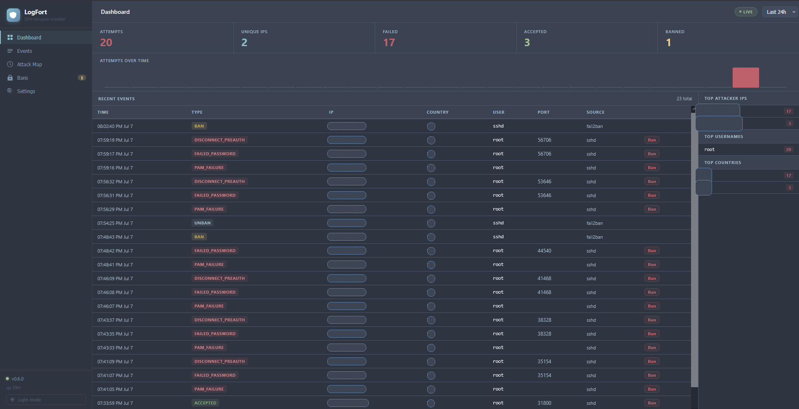

[English](README.md) · [Русский](README_RU.md)

# LogFort

[](https://github.com/unwinds/logfort/actions/workflows/ci.yml)
[](https://github.com/unwinds/logfort/releases/latest)
[](LICENSE)
[](https://go.dev)

**Дашборд для мониторинга SSH и nginx атак в реальном времени — самохостируемый, установка одной командой, без облака.**

LogFort следит за вашими логами авторизации и показывает живой браузерный дашборд: кто атакует, откуда, какие логины пробует — и карту мира с источниками атак. Ни байта данных не покидает ваш сервер.



---

## Возможности

- 🔴 **Live-поток событий** — входы и попытки входа отображаются мгновенно через SSE, без поллинга
- 🗺️ **Офлайн карта атак** — Leaflet + встроенный GeoJSON, внешние тайл-серверы не нужны
- 📊 **Статистика и таймлайн** — топ атакующих IP, логинов, стран; почасовой/ежедневный бар-чарт
- 🚫 **Бан в один клик** — блокировка через nftables или fail2ban с полной историей банов/разбанов и **опциональным сроком** (от 1 часа до 30 дней или навсегда); истёкшие баны снимаются автоматически
- 🔔 **Уведомления** — Telegram, Discord, Slack, ntfy, Gotify, Email (SMTP) или любой webhook; правила: `accepted_login`, `ban`, `new_country`, `threshold:N/dur`, `digest:daily`, `digest:weekly`
- 📰 **Ежедневные / еженедельные дайджесты** — утренняя сводка попыток, топ-атакующих и банов в любой канал уведомлений
- 📋 **Браузер событий** — пагинация, фильтры по типу, IP и логину, кликабельные IP, экспорт в CSV одной кнопкой
- 📁 **Несколько источников логов** — sshd `auth.log` / `secure`, nginx `error.log` + `access.log`, **Postfix SASL** + **Dovecot** (почтовый брутфорс), `fail2ban.log`, systemd journal
- 🔒 **HTTP Basic Auth** — опциональная защита дашборда
- 🛡️ **Приватность прежде всего** — ноль исходящих запросов во время работы; GeoIP и ASN — локальные `.mmdb` файлы
- 🤖 **Авто-бан** — автоматически банить IP, превысившие настраиваемый порог; баны истекают через настраиваемое время (по умолчанию 24 ч) — динамические IP атакующих не засоряют фаервол навсегда
- 🏢 **ASN-обогащение** — видно, из сети какого оператора идёт атака, полностью офлайн
- ⚙️ **Настройки в браузере** — уведомления, авто-бан, allowlist и хранение данных настраиваются без перезапуска контейнера
- 🛟 **Бэкап в один клик** — консистентный снапшот SQLite скачивается из Settings → General в любой момент
- ✅ **Allowlist** — домашние/офисные IP защищены от бана навсегда, редактируется прямо в UI
- 📈 **Метрики Prometheus** — эндпоинт `/metrics`: счётчики разобранных строк, активные баны, SSE-клиенты, размер БД; готовый [дашборд Grafana](docs/grafana-dashboard.json) в комплекте
- 🎬 **Демо-режим** — `LOGFORT_DEMO=true` наполняет дашборд реалистичным синтетическим трафиком, сервер не нужен
- 🕵️ **Аудит привилегий** — ошибки sudo и `useradd`/`userdel` отслеживаются отдельно от статистики атак, есть опциональное правило уведомлений `sudo`
- 🧱 **Локальный threat-блоклист** — помечать или сразу банить IP из локального файла IP/CIDR, без внешних запросов
- 🩺 **Состояние хоста** — CPU, память, диск и load average из `/proc`, отображаются в шапке и в Settings, доступны на `/metrics`
- 🔏 **Слежение за TLS-сертификатами и портами** — опциональные алерты об истечении сертификата или появлении нового слушающего TCP-порта
- 🔎 **Профиль IP** — клик по любому IP открывает карточку: первое/последнее появление, разбивка по типам событий, статус бана/allowlist, последняя активность

---

## Быстрый старт

```bash
curl -fsSL https://raw.githubusercontent.com/unwinds/logfort/main/install.sh | sudo bash
```

Скрипт установки:
- Определяет дистрибутив (Debian/Ubuntu/RHEL/Rocky/Alma)
- Опционально устанавливает Docker и fail2ban и настраивает sshd-джейл с **точным подсчётом попыток** — вы выбираете число попыток до бана и длительность бана, значения проверяются после перезапуска (штатный фильтр fail2ban считает лишние строки лога и банит после 2 попыток из «3»; LogFort ставит исправленный фильтр)
- Опционально включает **управление fail2ban из веб-интерфейса** (бан/разбан IP, изменение попыток и длительности бана в Settings → Firewall)
- Предлагает выбор способа установки: **Docker** (рекомендуется) или **bare-metal** (бинарник релиза + systemd-юнит — Docker не нужен)
- Предлагает выбор бэкенда: **file** (auth.log) или **journald** (systemd journal)
- Автоматически определяет путь к лог-файлу и настраивает доступ контейнера к нему (группа лога / монтирование каталога, переживающее logrotate)
- Предлагает скачать бесплатные базы GeoIP + ASN (DB-IP Lite, без регистрации)
- Генерирует готовый `docker-compose.yml` (или `logfort.env` + systemd-юнит)
- Опционально скачивает образ и запускает контейнер / сервис

Удалить всё позже: `sudo bash install.sh --uninstall`

> **Параметры:** `--dir /opt/logfort` и `--image ghcr.io/unwinds/logfort:latest`

После установки откройте дашборд через SSH-туннель:

```bash
ssh -L 8080:localhost:8080 user@yourserver
# Откройте http://localhost:8080
```

---

## GeoIP и ASN (опционально, рекомендуется)

Скачайте бесплатные базы [DB-IP Lite](https://db-ip.com/db/lite/city) — без регистрации. City нужна для карты атак; ASN показывает, из сети какого оператора идёт атака:

```bash
curl -L "https://download.db-ip.com/free/dbip-city-lite-$(date +%Y-%m).mmdb.gz" \
  | gunzip > /opt/logfort/data/geo.mmdb
curl -L "https://download.db-ip.com/free/dbip-asn-lite-$(date +%Y-%m).mmdb.gz" \
  | gunzip > /opt/logfort/data/asn.mmdb
docker compose -f /opt/logfort/docker-compose.yml restart
```

Также поддерживаются MaxMind GeoLite2 City / GeoLite2 ASN (тот же формат mmdb). Все проверки выполняются локально — наружу не уходит ничего.

---

## Docker Compose вручную

Если не хотите использовать скрипт установки:

```yaml
services:
  logfort:
    image: ghcr.io/unwinds/logfort:latest
    container_name: logfort
    ports:
      - "127.0.0.1:8080:8080"
    volumes:
      # Монтируйте каталог, а не файл: монтирование одного файла фиксирует
      # inode, и после первого logrotate новые записи перестают приходить.
      - /var/log:/host/log:ro
      - /etc/localtime:/etc/localtime:ro   # TZ хоста — время в auth.log локальное
      - ./data:/data
    # auth.log обычно 640 root:adm — добавьте контейнеру группу лога,
    # иначе файл не прочитать. GID: stat -c %g /var/log/auth.log
    group_add:
      - "4"
    environment:
      - LOGFORT_LISTEN=0.0.0.0:8080
      - LOGFORT_LOG_PATHS=/host/log/auth.log
      - LOGFORT_DB_PATH=/data/logfort.db
    restart: unless-stopped
```

> **RHEL/Rocky/Alma:** `/var/log/secure` имеет права `600 root:root` — замените `group_add` на `user: "0:0"` и укажите `LOGFORT_LOG_PATHS=/host/log/secure`.

Если лог-файл не читается, дашборд показывает красный баннер с причиной (также видно в `docker logs logfort`).

---

## Конфигурация

Все настройки задаются переменными окружения. Настройки уведомлений можно также менять через вкладку Settings в браузере без перезапуска.

### Основные

| Переменная | По умолчанию | Описание |
|---|---|---|
| `LOGFORT_LISTEN` | `127.0.0.1:8080` | Адрес HTTP-сервера (внутри Docker используйте `0.0.0.0:8080`) |
| `LOGFORT_BACKEND` | `file` | Бэкенд логов: `file` или `journald` |
| `LOGFORT_LOG_PATHS` | `/host/auth.log` | Пути к лог-файлам через запятую (sshd, nginx определяются автоматически) |
| `LOGFORT_JOURNALD_UNIT` | `ssh.service` | Юнит systemd для слежения (только бэкенд journald) |
| `LOGFORT_FAIL2BAN_LOG` | _(пусто)_ | Опциональный лог fail2ban — воспроизводится с начала при каждом запуске |
| `LOGFORT_DB_PATH` | `/data/logfort.db` | Путь к SQLite базе данных |
| `LOGFORT_GEOIP_DB` | `/data/geo.mmdb` | Путь к mmdb файлу GeoIP City; игнорируется если отсутствует |
| `LOGFORT_ASN_DB` | `/data/asn.mmdb` | Путь к mmdb файлу ASN (DB-IP ASN Lite / GeoLite2-ASN); игнорируется если отсутствует |
| `LOGFORT_RETENTION_DAYS` | `90` | Удалять события старше N дней |
| `LOGFORT_LOG_LEVEL` | `info` | `debug`, `info`, `warn`, `error` |
| `LOGFORT_HOME_LAT` / `_LON` | _(пусто)_ | Координаты домашнего маркера на карте атак |
| `LOGFORT_DEMO` | `false` | Демо-режим: синтетический трафик вместо реальных логов (не для продакшена) |

### Threat Intel и мониторинг хоста

| Переменная | По умолчанию | Описание |
|---|---|---|
| `LOGFORT_BLOCKLIST` | _(пусто)_ | Локальный файл блоклиста IP/CIDR (по одной записи на строку, `#` — комментарии); совпадение помечает событие и отображается в Settings → General |
| `LOGFORT_BLOCKLIST_AUTOBAN` | `false` | Банить IP сразу при совпадении с блоклистом (нужен включённый responder) |
| `LOGFORT_TLS_WATCH` | _(пусто)_ | `host[:port]` через запятую (порт по умолчанию `:443`) для слежения за истечением сертификата; алерт при ≤14 днях до истечения |
| `LOGFORT_PORTS_WATCH` | `false` | Следить за локально слушающими TCP-портами; алерт при появлении нового (только Linux) |

### Аутентификация

| Переменная | По умолчанию | Описание |
|---|---|---|
| `LOGFORT_AUTH_ENABLED` | `false` | Включить HTTP Basic Auth (все маршруты кроме `/api/health`) |
| `LOGFORT_AUTH_USER` / `_PASS` | _(пусто)_ | Логин и пароль — оба обязательны при включённой аутентификации |

### Активная блокировка

| Переменная | По умолчанию | Описание |
|---|---|---|
| `LOGFORT_RESPONDER_ENABLED` | `false` | Включить интеграцию с фаерволом |
| `LOGFORT_RESPONDER_BACKEND` | `nftables` | `nftables` или `fail2ban` |
| `LOGFORT_NFT_TABLE` | `inet filter` | Таблица nftables (`family name`) |
| `LOGFORT_NFT_SET` | `logfort_block` | Имя сета nftables (должен существовать) |
| `LOGFORT_FAIL2BAN_JAIL` | `sshd` | Имя джейла fail2ban |
| `LOGFORT_FAIL2BAN_SOCKET` | `/var/run/fail2ban/fail2ban.sock` | Командный сокет fail2ban (смонтируйте `/var/run/fail2ban` в контейнер) |
| `LOGFORT_IGNORE_IPS` | RFC-1918 + loopback | IP/CIDR, которые никогда не блокируются |

Если смонтировать сокет fail2ban (`- /var/run/fail2ban:/var/run/fail2ban` + `user: "0:0"` — сокет доступен только root), LogFort общается с fail2ban напрямую: бан/разбан из UI работает через бэкенд `fail2ban`, а в **Settings → Firewall** можно менять число попыток до бана и длительность бана на лету, без перезапуска. При перезапуске fail2ban LogFort сам восстанавливает эти значения.

### Уведомления

| Переменная | По умолчанию | Описание |
|---|---|---|
| `LOGFORT_NOTIFY_WEBHOOK_URL` | _(пусто)_ | Webhook URL (POST JSON) |
| `LOGFORT_NOTIFY_TELEGRAM_TOKEN` / `_CHAT_ID` | _(пусто)_ | Telegram-бот |
| `LOGFORT_NOTIFY_DISCORD_URL` | _(пусто)_ | Discord webhook |
| `LOGFORT_NOTIFY_SLACK_URL` | _(пусто)_ | Slack incoming webhook |
| `LOGFORT_NOTIFY_NTFY_URL` | _(пусто)_ | URL топика ntfy (например `https://ntfy.sh/my-topic`) |
| `LOGFORT_NOTIFY_NTFY_TOKEN` | _(пусто)_ | Токен доступа ntfy (опционально, для закрытых топиков) |
| `LOGFORT_NOTIFY_GOTIFY_URL` / `_TOKEN` | _(пусто)_ | URL сервера Gotify + токен приложения (нужны оба) |
| `LOGFORT_NOTIFY_SMTP_HOST` | _(пусто)_ | SMTP-сервер `host:port` (465 = implicit TLS, иначе STARTTLS) |
| `LOGFORT_NOTIFY_SMTP_USER` / `_PASS` | _(пусто)_ | Учётные данные SMTP (опционально) |
| `LOGFORT_NOTIFY_SMTP_FROM` / `_TO` | _(пусто)_ | Отправитель и получатели через запятую (нужны оба) |
| `LOGFORT_NOTIFY_RULES` | _(пусто)_ | Через запятую: `accepted_login`, `ban`, `new_country`, `sudo`, `threshold:N/dur`, `digest:daily`, `digest:weekly` |

Все каналы также настраиваются на лету в **Settings → Notifications** — без переменных окружения и перезапуска. Переменные окружения всегда имеют приоритет над значениями из UI (такие поля показываются заблокированными).

---

## HTTP API

| Эндпоинт | Описание |
|---|---|
| `GET /api/health` | Статус, версия, аптайм, счётчики парсера, проверка БД — 503 при неисправной БД (аутентификация не требуется) |
| `GET /api/stats?window=24h` | Агрегаты + таймлайн (`1h\|6h\|24h\|7d\|30d\|all`) |
| `GET /api/events` | Список событий с фильтрами (`type`, `ip`, `user`, `country`, `since`, `until`, `limit`, `offset`) |
| `GET /api/events.csv` | Те же фильтры, выгрузка CSV (до 10 000 строк) |
| `GET /api/bans?active=true` | История банов |
| `GET /api/bans.csv` | История банов в CSV |
| `GET /api/map?window=24h` | Гео-агрегированные точки атак |
| `GET /api/stream` | Живые события через Server-Sent Events |
| `GET /api/backup` | Консистентный снапшот SQLite (скачивание) |
| `GET /api/vitals` | Состояние хоста (CPU/память/диск/load), результаты проверки TLS-сертификатов, слушающие порты |
| `GET /api/ip?ip=<ip>` | Профиль IP: агрегированные счётчики, geo/ASN/threat, статус бана/allowlist, последние события |
| `GET /metrics` | Формат Prometheus (учитывает basic auth); [дашборд Grafana](docs/grafana-dashboard.json) в комплекте |
| `POST /api/ban` / `POST /api/unban` | Ручной бан (нужен responder); `duration_secs` задаёт срок бана (0 = навсегда) |

---

## Поддерживаемые источники логов

| Источник | Определяется по |
|---|---|
| sshd (`auth.log`, `secure`, OpenSSH 9+ `sshd-session`) | syslog/RFC3339 префикс + `proc=sshd` |
| nginx `error.log` | Префикс `YYYY/MM/DD HH:MM:SS [` |
| nginx `access.log` | Формат `IP - user [ts]`, только ответы 401 |
| Postfix (`mail.log`) | `proc=postfix/smtpd`, ошибки SASL-аутентификации |
| Dovecot (`mail.log`) | `proc=dovecot`, ошибки входа imap/pop3-login |
| fail2ban | Префикс `YYYY-MM-DD HH:MM:SS,ms fail2ban` |
| sudo / useradd / userdel (аудит привилегий) | `proc=sudo`, `proc=useradd`, `proc=userdel` |
| systemd journal | `LOGFORT_BACKEND=journald` |

Источник определяется по каждой строке отдельно — в `LOGFORT_LOG_PATHS` можно указать любой набор файлов (например `/host/log/auth.log,/host/log/mail.log`).

**Типичные пути к логам по дистрибутиву:**

| Дистрибутив | Путь |
|---|---|
| Debian / Ubuntu | `/var/log/auth.log` |
| RHEL / Fedora / CentOS | `/var/log/secure` |
| Arch / Alpine / Debian 13+ | journald (`LOGFORT_BACKEND=journald`) |

---

## Бэкенд journald

Для систем, которые логируют через systemd journal, а не в файл (Arch, Alpine, Debian 13+):

```yaml
services:
  logfort:
    image: ghcr.io/unwinds/logfort:latest
    group_add:
      - "NNN"   # GID группы systemd-journal: getent group systemd-journal | cut -d: -f3
    volumes:
      - /run/log/journal:/run/log/journal:ro
      - /var/log/journal:/var/log/journal:ro
      - /run/systemd/journal:/run/systemd/journal:ro
      - /etc/machine-id:/etc/machine-id:ro
      - ./data:/data
    environment:
      - LOGFORT_LISTEN=0.0.0.0:8080
      - LOGFORT_BACKEND=journald
      - LOGFORT_JOURNALD_UNIT=ssh.service
```

Скрипт установки генерирует это автоматически при выборе бэкенда journald.

---

## Безопасность

- LogFort **слушает на `127.0.0.1` по умолчанию** — не открывайте его напрямую в интернет.
- Дашборд показывает чувствительные данные (IP атакующих, логины, время).
- Используйте SSH-туннель, Tailscale или WireGuard для удалённого доступа.
- Включите HTTP Basic Auth в качестве дополнительного уровня защиты.
- Функция активной блокировки изменяет правила фаервола — проверьте `LOGFORT_IGNORE_IPS`, чтобы случайно не заблокировать нужные IP.

---

## Разработка

Требуется Go 1.25+. Без CGO — используется `modernc.org/sqlite` (чистый Go).

```bash
# Сборка
go build -ldflags="-X main.version=dev" -o ./logfort ./cmd/logfort

# Тесты (всегда с -race)
go test -race ./...

# Запуск локально на тестовых данных
LOGFORT_LOG_PATHS=$(pwd)/testdata/auth_debian.log \
LOGFORT_DB_PATH=/tmp/logfort-dev.db \
LOGFORT_LISTEN=127.0.0.1:8080 \
go run ./cmd/logfort

# Или полный дашборд на синтетическом трафике (логи не нужны)
LOGFORT_DEMO=true \
LOGFORT_DB_PATH=/tmp/logfort-demo.db \
LOGFORT_LISTEN=127.0.0.1:8080 \
go run ./cmd/logfort

# Линтер
golangci-lint run
```

---

## Релиз

```bash
git tag v1.2.3 && git push origin v1.2.3
```

Пуш тега `v*` запускает GitHub Actions: тесты → goreleaser → мультиархитектурные Docker-образы (`linux/amd64`, `arm64`, `armv7`) публикуются в `ghcr.io/unwinds/logfort`.

---

## Лицензия

[MIT](LICENSE)
